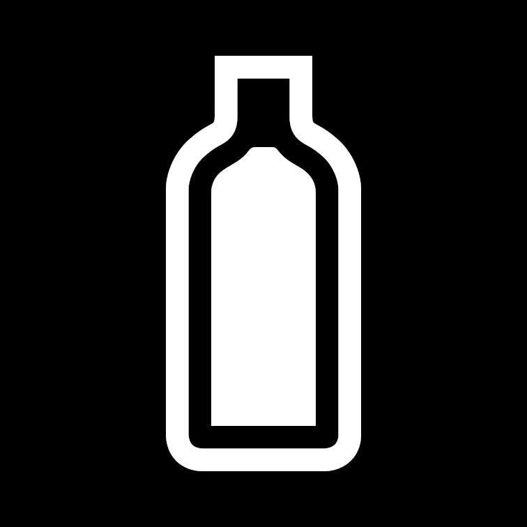

# DayZ (videogame)

*DayZ is an indie game created by Dean Hall and published by Bohemia Interactive. The game is an open world zombie survival game that where you are dropped in a semi-random location on the map with nothing but the clothes on your back and a fruit of some kind. You're only objective is to survive; not just zombies, but the elements and especially other players.*

## How realistic is it?
The game aims to be realistic in a very punishing manner. Your character has base statuses that you need to keep track of or else you'll die pretty quickly. Each stat has multiple thresholds that determine how much health is being gained or lossed. Thus, any stat that isn't health won't kill you by reaching 'zero' (really jsut the lowest threshold) but it will drain your health at it's highest rate.

#### Health

Your character has a starting health and if you get hit or injured then you'll lose health points. What's also true is that if any of the other stats go "into the red" (which just means very low) then your health goes down incrementally.

The way to get your health back to normal is to have all of the other stats satiated at the same time and that will incrementally bring your health back over time.

#### Blood

This stat is how much blood your character still has and really has to do with being cut because of blood loss.

If you get a cut from either zombies or another player then you have to be quick to use rags or bandages in order to stop the bleeding.

#### Energy

This is your characters hunger. You need to make sure your character eats regularly or else the energy level goes down.

In the game there's a lot of ways to acquire food, all varying in their potency. You can simply scavenge houses and hope to find a can of tuna or a fruit (among other things) which can help satiate for a short time. Occasionally you can stumble on a garden of sorts and harvest food that way. The most long term solution is to hunt animals because the quantity and quality of the return is immense.

Also, if you have the correct tools to make a fire (lighter, matches, or making a hand drill), you can cook pretty much any food in order to make it more potent. In terms of meat, you are required to cook it before eating or else you will get a disease status.

#### Water

This is your characters hydration. Similar to real life, you need to stay hydrated.

Around the map are wells where you can get water, which is possibly the easiest way of getting water, but with their sparsity you put yourself in danger if you aim to keep traveling. Otherwise, you can find purification tablets to purify bottles, jugs, buckets, etc. so you can have portable drinking water.

## How nature is out to ruin your day
I'm trying to refrain from letting my bad experiences in the game bleed into this content to I'm going to list off some stuff that happens in the game.

- If you spend really any time in the rain:
    - Your clothes will get moist or damp and you'll have to wring them out or you'll perpetually be cold
    - You can develop a cold which affects your stamina usage, causes you to sneeze which gives away your position to players, animals, and zombies
        - You can spread diseases to other players by being around them or by sharing food and drinks
- You can break bones which requires you to make a splint and have other stats be high enough to maintain your health or you can die of shock (whether it's the shock itself, not being able to move anywhere to get resources, or passing out in an inopportune situation like under water or in the open)
- If you don't wash your hands after handling raw meat and you eat something else like chips per se then you'll get sick
- Standing too close to a heat source or having too many freshly cooked foods stored in, say, your jacket and pants will cause you to overheat
- Drinking water or eating too fast while your sick will cause you to throw up

## See Also
- [Character Stats](https://dayz.fandom.com/wiki/Character_Status)
- [Developers](https://dayz.fandom.com/wiki/Developers)
- [Sickness and Disease](https://www.trueachievements.com/game/DayZ/walkthrough/6)

## References
1. DayZ Fandom Wiki